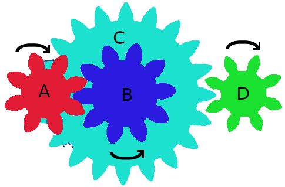

# Gears

Calculate torques, speeds, direction for each items of a gear system.  
Watch youtube [explainations](https://www.youtube.com/watch?v=JMdPXTXIPWU).

## Gear

Composed by

* Id
* Teeth
* Torque
* Speed
* Forward
* Composed

## Gear system

### 4 distinct gears


Check use case [parameters file](tests/fixtures/Entity/Gears4distinct.json).  

Input

|Id | Teeth | Torque | Speed | Forward | Composed |
|---|-------|--------|-------|---------|----------| 
| A | 8     | 20     | 150   | true    | false    |
| B | 10    | ?      | ?     | ?       | false    |
| C | 20    | ?      | ?     | ?       | false    |
| D | 8     | ?      | ?     | ?       | false    |

Output 

|Id | Teeth | Torque | Speed | Forward | Composed |
|---|-------|--------|-------|---------|----------| 
| A | 8     | 20     | 150   | true    | false    |
| B | 10    | 25     | 120   | false   | false    |
| C | 20    | 50     | 60    | true    | false    |
| D | 8     | 20     | 150   | false   | false    |

### 4 gears with BC composed

  

Check use case [parameters file](tests/fixtures/Entity/Gears4composed.json).  

Input

|Id | Teeth | Torque | Speed | Forward | Composed |
|---|-------|--------|-------|---------|----------| 
| A | 8     | 20     | 150   | true    | false    |
| B | 10    | ?      | ?     | ?       | false    |
| C | 20    | ?      | ?     | ?       | true     |
| D | 8     | ?      | ?     | ?       | false    |

Output 

|Id | Teeth | Torque | Speed | Forward | Composed |
|---|-------|--------|-------|---------|----------| 
| A | 8     | 20     | 150   | true    | false    |
| B | 10    | 25     | 120   | false   | false    |
| C | 20    | 25     | 120   | false   | true     |
| D | 8     | 10     | 300   | true    | false    |

## Setup

First git clone this repo.  

### Requirements

* php >= 7.3
* composer
* phpdbg

### Composer scripts

Setup dependencies (once)
```
composer install
```

Run use case
```
composer start
```

Run unit tests and generate coverage.  
After tests ran, to check coverage, open your browser in coverage folder and pick index.html file
```
composer test
```

Lint project as PSR12
```
composer lint
```

Update dependencies and regenerate autoloader PSR4
```
composer up
```

Run syntax analyzer
```
composer phpstan
```

Generate [doc](doc/html/index.xhtml)
```
composer doc
```

Regenerate autoloader optimized
```
composer genautoload
```

